# ⚡ RayStack

A fast, no-nonsense monitor for Pump.fun on Solana.

I built this because I needed a way to catch new token launches immediately without the lag you get from standard RPC polling. It connects directly to a Solana WebSocket, filters the logs for Pump.fun's "Create" instruction, and pipes the alerts straight to Discord.

It's written in Rust so it just runs in the background without eating up memory.

## How it works

The logic is pretty simple: it's a producer-consumer setup. One part waits for the logs, passes them to a channel, and the other part processes them and handles the alerts.

```mermaid
graph TD
    subgraph Network
        RPC[Solana RPC WSS]
        Discord[Discord Webhook]
    end

    subgraph "RayStack Engine"
        Listener[("👂 Listener")]
        Channel{{"⚡ Fast Channel"}}
        Processor[("⚙️ Processor")]

        Listener -- "Subscribes to logs" --> RPC
        RPC -- "Stream events" --> Listener
        Listener -- "Found a match?" --> Channel
        Channel -- "Send data" --> Processor
        Processor -- "Parse Mint & Notify" --> Discord
    end

    style RayStack Engine fill:#2b2b2b,stroke:#555,color:#fff
    style Network fill:#000,stroke:#fff,color:#fff
    style Listener fill:#36454F,stroke:#4caf50
    style Processor fill:#36454F,stroke:#e91e63
```



## Features

*   **Fast**: Uses WSS logs subscription, so no polling delay.
*   **Specific**: Only looks for the `Create` instruction on the Pump.fun program (`6EF8...`).
*   **Async**: The listener never blocks. It dumps events into a buffer and keeps listening while the processor handles the Discord API calls.
*   **Resilient**: If the socket drops, it just reconnects automatically.

## Setup

1.  Clone the repo.
2.  Make a `.env` file:

    ```bash
    RPC_URL=wss://api.mainnet-beta.solana.com
    DISCORD_WEBHOOK=https://discord.com/api/webhooks/...
    ```

3.  Run it:

    ```bash
    cargo run --release
    ```

That's it. It'll start printing logs when it finds new tokens.
